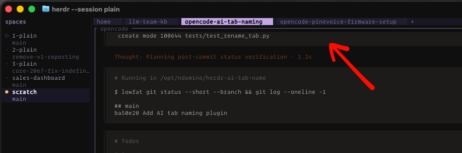

# herdr-ai-tab-name

Automatically rename Herdr tabs with short dash-case names from pane context using any local LLM. This is a rewrite of my tmux variant of this same plugin - [`tmux-ai-window-name`](https://github.com/ndom91/tmux-ai-window-name).



## What it does

- Runs name generation when a tab receives focus, or when manually triggered.
- Caches by foreground command, working directory, and Git branch. Revisiting an unchanged tab makes no LLM call.
- Uses the directory name when every pane is an idle shell.
- Reads recent pane output only on a cache miss.
- Prefixes names for known apps such as `claude`, `opencode`, and `nvim`.

## Install

```sh
git clone https://github.com/ndom91/herdr-ai-tab-name
herdr plugin link $(pwd)/herdr-ai-tab-name
config_dir="$(herdr plugin config-dir ndomino.ai-tab-name)"
cp $(pwd)/herdr-ai-tab-name/config.example.toml "$config_dir/config.toml"
cp $(pwd)/herdr-ai-tab-name/secrets.example.toml "$config_dir/secrets.toml"
```

Set `llm.url`, `llm.model`, and `llm.ssl_verify` (optional) in `config.toml`. Set `llm.api_key` in `secrets.toml`. A non-empty `HERDR_AI_TAB_NAME_API_KEY` takes precedence over the secret file.

You can commit `config.toml` to dotfiles. Keep `secrets.toml` out of version control. The plugin rejects an API key in `config.toml`.

## Configuration

```toml
# config.toml
[llm]
url = "https://api.openai.com/v1/chat/completions" # Any OpenAI-compatible Chat Completions endpoint.
model = "gpt-4.1-mini"                              # Model to use.
# ssl_verify = "/path/to/custom-ca.pem"                  # Optional custom CA.

[rename]
max_lines_per_pane = 40                                  # Context lines per pane.
# max_title_chars = 32                                    # Optional: prompt limit and final trim.
# max_title_words = 3                                     # Optional: prompt suggestion only.
```

Set the API key in `secrets.toml`, not `config.toml`:

```toml
[llm]
api_key = "your-api-key"
```

Any provider exposing an OpenAI-compatible Chat Completions API can be used by setting its full endpoint URL and model name. Native Anthropic Messages endpoints are not supported.

Hyphen-separated title parts count as words: `refactor-react-effect` is three words.

## Refresh action

The plugin exposes `ndomino.ai-tab-name.refresh`, which ignores the cache for the active tab. Bind it in `~/.config/herdr/config.toml`:

```toml
[[keys.command]]
key = "prefix+shift+a"
type = "plugin_action"
command = "ndomino.ai-tab-name.refresh"
description = "refresh AI tab name"
```

Then reload the configuration with `<leader> shift+a`.

## License

MIT
